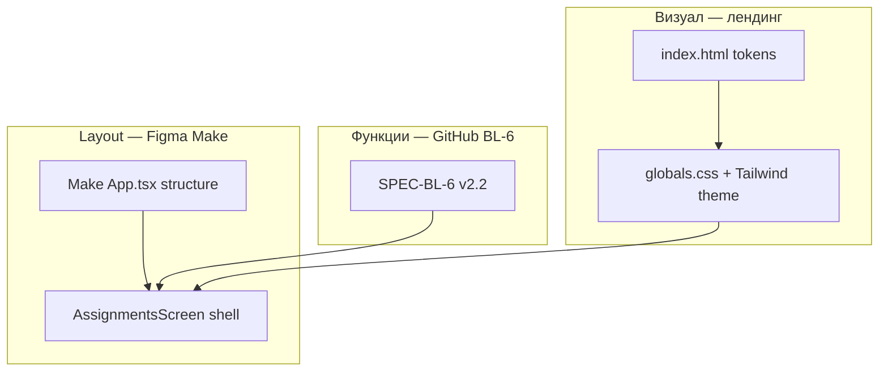
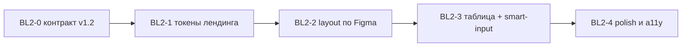

# BL2-0 — Редизайн «Администратор поручений»

**Repository:** [Plaxotin/AI-PMO](https://github.com/Plaxotin/AI-PMO) — синхронизирован с `origin/main`  
**Figma Make (layout, read-only):** [Create sleek service interface](https://www.figma.com/make/TwFYq4aQqhaOvxZzGuAziJ/Create-sleek-service-interface) (`fileKey`: `TwFYq4aQqhaOvxZzGuAziJ`)  
**Визуал бренда:** `index.html` (лендинг), [ai-pmo.vercel.app](https://ai-pmo.vercel.app)  
**Функциональность:** `docs/specs/SPEC-BL-6-assignments-admin-v2.2.md`, `app/src/components/assignments/AssignmentsScreen.tsx`  
**Workflow:** `docs/SUBAGENTS_WORKFLOW.md`  
**Status:** plan v1.2 — BL2-1…BL2-4 `verified` (2026-06-01); редизайн shell завершён  
**Date:** 2026-06-01

---

## Принцип редизайна (зафиксировано командой)

| Слой | Источник | Что именно |
|------|----------|------------|
| **Визуал** (цвета, шрифты, фон, glass, градиенты, chips, кнопки) | **Лендинг** `index.html` | Бренд AI PMO: тёмная тема, cyan/blue, DM Sans + Instrument Sans |
| **Компоновка, эргономика, размеры** | **Figma Make** | Структура экрана, отступы, ширины колонок, toolbar, шапка |
| **Поведение и данные** | **SPEC-BL-6 v2.2 + код на GitHub** | Smart-input, PMI-колонки, Google Sheets, edit-mode, фильтры в заголовках |

**Figma Make не редактируем** — только читаем через MCP (`get_design_context`, resources). Все отклонения Make (светлая MUI-тема, колонка «Бренд», лишние статусы) **перекрашиваем и подгоняем** под лендинг и BL-6 в коде `app/`.

---

## Два референса: что откуда брать

### A. Лендинг → визуал (применить в `app/`)

| Токен / паттерн | Значение в `index.html` | Использование в реестре |
|-----------------|-------------------------|-------------------------|
| Фон страницы | `--bg-void` `#060B18` | `body` / корень экрана |
| Поверхности | `--bg-deep`, `--bg-card`, `--glass-bg` | Шапка, карточка таблицы, inputs |
| Акцент | `--cyan` `#06B6D4`, `--blue` `#3B82F6` | Primary CTA, logo, focus, активные chips |
| Градиент | `--accent-gradient` | Кнопка «Создать» / главные действия |
| Текст | `--text-primary`, `--secondary`, `--muted` | Таблица, подписи, placeholder |
| Шрифты | Instrument Sans (display), DM Sans (body) | `layout.tsx`, заголовки, таблица |
| Радиусы | `--radius` 16px, `--radius-sm` 10px | Карточка таблицы, поля, logo 8px как в Make |
| Glass | `backdrop-filter`, `--glass-border` | Шапка (опционально), панель toolbar |

**Не брать из Make для визуала:** светлый `#f5f7fa`, MUI default palette, Material Icons set (можно lucide/inline SVG в стиле лендинга).

### B. Figma Make → layout и эргономика

| Зона Make | Параметры (ориентир из `App.tsx`) | Куда в продукте |
|-----------|-----------------------------------|----------------|
| **Шапка** | `px: 24`, `py: 16`, logo **32×32**, radius 8, title **h6 / 600**, actions справа | Заменить текущий **sidebar + узкий header** на **единую top bar**; пункты sidebar («Sheets», «Редактировать реестр») → меню **Settings** (⋮) как в Make |
| **Контент** | `p: 24`, `maxWidth: 1400`, centered | `main` контейнер реестра |
| **Toolbar** | поиск `flex: 1`, select **minWidth 150**, кнопка «Создать» | Строка **над таблицей**: smart-input остаётся (BL-6), но **визуально** выровнять с Make — поиск/фильтр слева, действия справа; 🎤 📎 ➤ — компактно рядом с полем ввода |
| **Таблица** | `TableContainer` + `Paper`, `boxShadow: 1`, header row bg subtle | Обернуть PMI-таблицу в **card** с glass/border лендинга |
| **Колонки** | № **60px**, приоритет/срок/статус **120–150px**, описание flex | Применить **пропорции** к PMI-колонкам (ID узкий, brief_name широкий) |
| **Строки** | `py` compact, hover на row | Hover `--bg-card-hover` |
| **Статус** | `Chip` outlined / filled | Chip в цветах лендинга (не MUI semantic) |
| **Режим правки** | IconButton Edit / Check в шапке | = существующий **registry edit mode** + иконка в header |
| **Footer** | «12 из 77» слева | Реальный count + pagination BL-6 |

**Не копировать из Make слепо:** колонку «Бренд»; набор статусов Make; отказ от smart-input BL-6.

### C. Текущий GitHub → что сохраняем

- Smart-input (текст / 🎤 / 📎) и direct-to-table edit-mode (✓ / ✗)
- Колонки PMI из SPEC-BL-6 (без «Бренд»)
- Фильтры ▾ в заголовках таблицы (эргономика Excel — **остаётся**, даже если в Make только один select; не деградировать)
- Google OAuth, подключение Sheet, batch save реестра
- Sidebar-функции → перенести в header/settings, **не удалять** функциональность

---

## Расхождения Make → продукт (нормализация в коде)

| Make | Продукт BL-6 | Действие |
|------|--------------|----------|
| Светлая тема | Тёмный лендинг | Только **тёмная** тема v1; light — backlog |
| Колонка «Бренд» | Нет в PMI | Не показывать |
| «Приоритет» chip MUI | PMI priority 1–3 | Колонка остаётся; стилизация под лендинг |
| Статусы RU в Make | PMI status 1–3 + labels | Лейблы из существующего маппинга в коде, не из Make |
| MUI | Tailwind в `AssignmentsScreen` | Рефактор разметки, без `@mui/*` |
| «Создать» без формы | Smart-input + parse | «Создать» фокусирует smart-input или открывает подсказку |
| Google Sheets в меню Make | BL-6 core | Оставить в Settings, не в toolbar |

---

## Зависимости

**Pre-flight:** `git pull origin main` ✓; `cd app && npm run dev`; для Sheets — `docs/plans/BL2-0_SECRETS_SETUP.md`.

---

## Фазы

### BL2-0 — Design contract (docs)

| | |
|--|--|
| **goal** | Утвердить split «лендинг = визуал, Make = layout»; чеклист зон экрана. |
| **deliverables** | Этот файл v1.2; при необходимости `docs/plans/BL2-0_LAYOUT_CHECKLIST.md` (скриншоты Make + лендинг side-by-side). |
| **acceptance** | Нет противоречий с SPEC-BL-6; Implementer может начать BL2-1 без правок Figma. |

**Verifier:** таблицы «Два референса» и «Расхождения» согласованы с product owner.

---

### BL2-1 — Design tokens (лендинг → `app/`)

| | |
|--|--|
| **goal** | Единая дизайн-система: `app/src/app/globals.css`, `@theme`, шрифты в `layout.tsx`. |
| **scope** | CSS variables из `index.html`; utility-классы `.glass`, `.btn-primary`, `.gradient-text`; **не менять** DOM-структуру экрана. |
| **acceptance** | Dev-страница или `/assignments` (даже со старым layout) использует токены лендинга. |

**Verifier:** сравнение hex/shrift с `index.html`; contrast AA на primary text.

---

### BL2-2 — Layout shell по Figma Make

| | |
|--|--|
| **goal** | Заменить **sidebar layout** на **top header + full-width main** по Make; перенести навигацию в Settings. |
| **scope** | Размеры/отступы из раздела «B. Figma Make»; заголовок «AI PMO — Администратор поручений»; logo 32px; `max-w-[1400px] mx-auto`. |
| **out of scope** | Перестройка колонок таблицы; смена логики Sheets. |
| **acceptance** | Wireframe экрана совпадает с Make по зонам; BL-6 пункты меню доступны из Settings. |

**Verifier:** checklist: нет `aside w-56`; есть top bar + toolbar row + card table area.

---

### BL2-3 — Таблица и smart-input в новом layout

| | |
|--|--|
| **goal** | PMI-таблица и smart-input внутри новой оболочки; пропорции колонок из Make; фильтры ▾ сохранены. |
| **scope** | Card-обёртка таблицы (glass); toolbar: smart-input + фильтры; chips статуса/приоритета в стиле лендинга. |
| **acceptance** | Полный сценарий BL-6: ввод текста → строка edit-mode → save; registry edit mode из header. |

**Verifier:** сценарий из SPEC-BL-6 §1 (smart-input + edit-mode); регрессии Sheets нет.

---

### BL2-4 — Polish

| | |
|--|--|
| **goal** | Пагинация, hover, focus rings, мобильная горизонтальная прокрутка таблицы, stub notifications. |
| **scope** | Footer count; MCP-скрин Make vs `/assignments` для spacing; keyboard nav в таблице. |
| **acceptance** | Визуально «как лендинг», ощущение плотности «как Make»; console clean. |

**Verifier:** viewport 1280 и 390; dark-only OK.

---

## Технические ориентиры

| Тема | Решение |
|------|---------|
| Файл UI | `app/src/components/assignments/AssignmentsScreen.tsx` (+ вынести подкомпоненты при >400 строк) |
| Стили | Tailwind 4 + CSS variables лендинга; **не** MUI |
| Make MCP | `get_design_context` / `App.tsx` только для layout-решений |
| Mockup `bl6-v2.2-main-screen.png` | Архивный референс UX; при конфликте с Make по layout — **приоритет Make**, по цвету — **лендинг** |

---

## Implementer handoff

После утверждения BL2-0:

> Реализуй **BL2-1** из `docs/BL2-0_DESIGN_TRANSITION_PLAN.md` v1.2: перенеси токены из `index.html` в `app/`. Layout не менять. Спроси: `Разрешите начать фазу BL2-1: Design tokens (лендинг)?`

Затем **BL2-2** — layout по Figma Make с визуалом уже из BL2-1.

---

## Changelog

| Version | Date | Notes |
|---------|------|-------|
| 1.0 | 2026-06-01 | Make-only (устарело) |
| 1.1 | 2026-06-01 | GitHub `app/` как основа |
| 1.2 | 2026-06-01 | **Лендинг = визуал; Figma Make = layout/размеры/эргономика**; sidebar → top bar |
