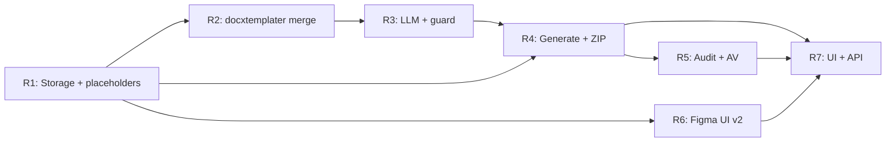

# BL-18 — План исправления (remediation): соответствие спеке

**Дата:** 2026-06-04  
**Контекст бага:** пользователь загружает корпоративный бланк (DOCX), вводит текст, нажимает «Сформировать письмо» — в результате **пустой Word-документ с текстом**, без бланка, логотипа и разметки шаблона.  
**Спека:** `docs/specs/SPEC-BL-18-official-letter-generator.md` (v1.2)  
**ADR:** `docs/specs/ADR-BL-18-01-tenant-model.md`, `docs/specs/ADR-BL-18-02-production-decisions.md` (§5 плейсхолдеры, §4 DOCX)  
**Предыдущие планы:** `docs/plans/BL18_PLAN.md` (landing mock), `docs/plans/BL18_DOWNLOAD_TEST_SCENARIO.md` (валидный OOXML без шаблона)
**Дизайн UI v2:** [Figma Make — Corporate Letter Generator](https://jolly-arrow-79732335.figma.site/) (продуктовое имя в макете: **«ДеловаяПочта: Генератор служебных писем»**)

---

## Planning summary

Текущая реализация BL-18 — **клиентский mock в `index.html`**: шаблон принимается в UI (`templateFile`), но **ни разу не читается** при генерации; `buildDocxBlob()` собирает **минимальный пустой OOXML** из сгенерированного текста; `buildMockLetter()` имитирует LLM через `setTimeout`. Бэкенд в `app/` **отсутствует** (нет маршрутов `/api/tenants/*/letters*`, нет `docxtemplater`, нет миграций `bl18_*`).

Корневая причина бага:

```2536:2570:index.html
  function buildMockLetter(){
    var content=contentArea.value.trim();
    // ... templateFile не используется ...
    return lines.join('\n');
  }
```

```2658:2705:index.html
  function buildDocxBlob(text){
    // ... создаёт новый document.xml с нуля; templateFile не используется ...
    return buildMinimalZip(docxFiles);
  }
```

План последовательно переводит BL-18 с landing-demo на **spec-compliant** контур: серверное хранение шаблона → валидация плейсхолдеров → LLM только для разрешённых полей → **docxtemplater** merge в загруженный DOCX → валидный DOCX + ZIP → аудит. Целевой UI — **Design v2** по макету Figma (трёхколоночный layout: бланки | форма | превью), реализуется в **`app/letters`**, а не в вертикальном wizard `#letter-workspace` в `index.html`. Подключение к API — после сборки backend (фазы R4–R5).

**MVP-ограничение по auth:** в prod спека и ADR требуют сессию; для локальной разработки допустим существующий режим `getAuthResult().mode === 'disabled'` (как в BL1-0), но **не** откладывать схему `tenant_id` — ADR A₀.

**Implementer:** перед каждой фазой — **явное одобрение пользователя** (см. `docs/SUBAGENTS_WORKFLOW.md`).

---

## Анализ разрывов: SPEC §11 vs текущая реализация

| # | Критерий приёмки (SPEC §11) | Текущий статус | Где в коде / пробел |
|---|----------------------------|----------------|---------------------|
| 1 | Загрузка DOCX-шаблона (≤10 МБ), до 5 вложений, русская суть, скачивание DOCX + ZIP, квота 1 ГБ на тенант | **Частично** | UI и валидация размера/типа в `index.html` (~2478–2534). Квоты, персистентность, реальные скачивания через API — **нет**. `templateFile` не участвует в сборке. |
| 2 | Доказуемо: тело шаблона DOCX **не** уходит в LLM | **N/A / ложноположительно** | LLM не вызывается (`mock-llm-v1`). Guard `buildLlmPayload()` **не реализован**. Заявление в UI (`letters.ws.security_notice`) не подкреплено кодом. |
| 3 | ФИО и должность подписанта — только плейсхолдеры, без автозаполнения | **Частично** | В текстовом preview — `{{SIGNATORY_NAME}}` / `{{SIGNATORY_TITLE}}` (`buildMockLetter`). В скачанном DOCX — сплошной текст параграфами, **без** полей шаблона и без гарантии сохранения плейсхолдеров бланка. |
| 4 | До 5 вложений допустимых форматов; перечень в письме | **Частично** | Имена в mock-тексте. В ZIP — строки `'[Attachment: …]'`, **не** оригинальные байты (`index.html` ~2794). |
| 5 | Аудит: пользователь, шаблон, время, провайдер модели, факт выдачи ZIP (§8) | **Частично** | In-memory mock в `index.html` (~2743–2754): нет `tenant_id`, `template_version`, `audit_id`, персистентности; `template_id` — случайный UUID от клиента. |
| 6 | ZIP: `letter.docx` + оригиналы приложений; без вложений — только `letter.docx` | **Частично** | Структура ZIP валидна (`buildMinimalZip`), `letter.docx` — валидный минимальный OOXML (`buildDocxBlob`), но **не из шаблона**; вложения — текстовые заглушки. |
| 7 | Вне MVP не требуются согласование, версии, почта, реестр | **Соответствует** | Не реализовано и не заявлено — ок. |

**Дополнительные разрывы (SPEC §3.1, ADR §5.1, §10):**

| Требование | Статус |
|------------|--------|
| Обязательные плейсхолдеры `{{LETTER_BODY}}`, `{{LETTER_SUBJECT}}`, … при upload | **Нет** — шаблон не парсится |
| Серверная сборка **docxtemplater** + pizzip | **Нет** — нет зависимости в `app/package.json` |
| REST `/api/tenants/:tenantId/letter-templates`, `/letters/generate` | **Нет** |
| Миграции `bl18_tenants`, `bl18_letters` | **Нет** (есть только `20260524000000_bl1_v1.sql`) |
| Валидация русского языка сути (кириллица ≥70%) | **Нет** |
| Антивирус вложений (ClamAV) | **Нет** |


---

## Design v2 — эталон UI (Figma Make)

**Макет:** https://jolly-arrow-79732335.figma.site/  
**Статус в проде сейчас:** устаревший wizard в `index.html` (одна колонка, 4 шага, upload файла на сессию).  
**Целевое состояние:** полноэкранное приложение «ДеловаяПочта» с постоянной библиотекой бланков.

### Соответствие экранов (макет → продукт)

| Элемент макета (Figma v2) | SPEC / ADR | Текущий `index.html` |
|---------------------------|------------|----------------------|
| Левая колонка **«Бланки»** / **«История»**, список шаблонов, **«+ Добавить»** | §3.1 п.2 версионирование шаблона; REST templates (ADR §10) | Одиночный upload DOCX на сессию, без списка и истории |
| Выбор бланка обязателен («Выберите бланк письма для продолжения») | `template_id` в generate | Файл в `templateFile`, без выделенного списка |
| **Тип документа** (select, напр. «Служебная записка») | Метаданные шаблона / паспорт стиля (§4) | Нет; только optional passport textarea |
| **Получатель / Обращение**, **Тема**, **Содержание** (отдельные поля) | LLM JSON: `salutation`, `subject`, `body` (ADR §3) | Одно поле «суть» |
| Счётчик символов, **«Очистить»**, **«Сбросить»** | Лимит gist 30–50k (ADR) | Нет счётчика |
| Кнопка **«Диктовать»** (микрофон) | **Вне MVP** (§3.2 STT) | Нет |
| Правая колонка **превью** («Здесь появится готовое письмо») | §3.1 п.9 предпросмотр / скачивание | Preview под формой после generate |
| **«Сформировать письмо»** disabled без бланка | Валидация до generate | Disabled без template file + gist |
| Светлая корпоративная тема (не glass landing) | UX продукта AI PMO | Glass-morphism лендинга |

### Решение по каналу UI (зафиксировано для remediation)

- **Основной маршрут:** `app/src/app/letters/page.tsx` + компоненты `app/src/components/letters/*` по макету Figma v2.
- **Лендинг:** карточка «Официальные письма» → ссылка на `/letters`; `#letter-workspace` — **deprecated** после R7 (удалить или редирект).
- **Токены дизайна:** вынести в `app/src/components/letters/letters-theme.css` (или Tailwind theme) по Figma; не смешивать с CSS переменными `index.html`.

## Фаза BL18-R1 — Схема данных, хранение шаблона, валидация плейсхолдеров

- **phase_id:** `BL18-R1`
- **title:** Миграции BL-18, upload шаблона, детекция обязательных плейсхолдеров
- **goal:** Шаблон DOCX сохраняется на сервере (метаданные + байты), при upload проверяется наличие обязательных плейсхолдеров ADR §5.1; при ошибке — `TEMPLATE_VALIDATION_FAILED` с чеклистом для администратора.
- **scope:**
  - SQL-миграции: `tenants`, `tenant_members`, `letter_templates`, `letter_template_versions`, `letter_storage_objects`, `letter_audit_events` (минимум по ADR-BL-18-01 §2, runbook §2).
  - Seed default tenant (`DEFAULT_TENANT_ID`) — согласование с `docs/plans/BL1-0_BL18-ALIGNMENT.md`.
  - Модуль `app/src/lib/letters/template-placeholders.ts`: извлечение `{{…}}` из DOCX **локально** (распаковка ZIP + скан `word/*.xml`, без LLM); список обязательных: `SIGNATORY_NAME`, `SIGNATORY_TITLE`, `LETTER_BODY`, `LETTER_SUBJECT`, `LETTER_SALUTATION`, `LETTER_CLOSING`, `ATTACHMENTS_LIST` (формат `{{NAME}}` как в ADR).
  - `app/src/lib/letters/template-validation.ts`: результат валидации + человекочитаемый чеклист для ошибки.
  - API: `POST /api/tenants/[tenantId]/letter-templates` (multipart: `file`, `name`, `style_passport?`), `GET` список, `POST …/versions` — по ADR §10.
  - Object storage или filesystem-адаптер `app/src/lib/letters/storage.ts` (префикс `{tenant_id}/letters/templates/…`); учёт байтов в `storage_used_bytes`.
  - Лимит файла 10 МБ, отказ при превышении квоты `TENANT_STORAGE_QUOTA_EXCEEDED`.
- **out_of_scope:**
  - Генерация письма, LLM, docxtemplater merge.
  - Антивирус (фаза R5).
  - Замена mock UI на лендинге.
- **dependencies:** Нет (первая фаза remediation).
- **files_or_areas:**
  - `supabase/migrations/20260604000000_bl18_tenants.sql` (новый)
  - `supabase/migrations/20260604000001_bl18_letters.sql` (новый)
  - `supabase/seed_bl18.sql` (новый, опционально)
  - `app/package.json` — `pizzip` (для парсинга плейсхолдеров)
  - `app/src/lib/letters/` — `template-placeholders.ts`, `template-validation.ts`, `storage.ts`, `types.ts`, `errors.ts`
  - `app/src/lib/db/letters.ts` (новый)
  - `app/src/app/api/tenants/[tenantId]/letter-templates/route.ts` (новый)
  - `app/src/app/api/tenants/[tenantId]/letter-templates/[id]/route.ts` (новый)
  - `app/src/app/api/tenants/[tenantId]/letter-templates/[id]/versions/route.ts` (новый)
  - `app/src/lib/api/route-helpers.ts` — расширение проверки tenant/session при необходимости
  - `app/.env.example` — уже содержит BL-18 секцию
- **acceptance_criteria:**
  1. Upload валидного тестового DOCX с всеми обязательными плейсхолдерами → `201`, `template_id`, `version=1`, файл доступен по storage key.
  2. Upload DOCX без `{{LETTER_BODY}}` → `400`/`422`, код `TEMPLATE_VALIDATION_FAILED`, тело содержит чеклист недостающих плейсхолдеров.
  3. Файл >10 МБ → `FILE_TOO_LARGE`.
  4. Повторная версия через `POST …/versions` увеличивает `version` monotonic.
  5. Unit-тест: `extractPlaceholdersFromDocx(buffer)` находит плейсхолдеры в `word/document.xml` и header/footer.
- **testing_scenario:**
  - **Setup:** `BL18_ENABLED=true`, `DATABASE_URL`, локальный storage или MinIO; подготовить `template-valid.docx` (с логотипом и всеми `{{…}}`) и `template-invalid.docx` (бланк без плейсхолдеров).
  - **Actions:** `curl -F file=@template-valid.docx -F name=Corp … POST /api/tenants/{DEFAULT_TENANT_ID}/letter-templates` → 201. Повторить с invalid → ошибка с чеклистом. `unzip -l` на сохранённом файле — структура исходного бланка сохранена.
  - **Expected:** Валидация отражает ADR §5.1; байты шаблона на диске идентичны загруженным.
  - **Evidence:** Вывод curl; лог SQL; скрин/список плейсхолдеров из API metadata.
- **status:** `planned`

---

## Фаза BL18-R2 — Сборка DOCX: merge в загруженный шаблон (docxtemplater)

- **phase_id:** `BL18-R2`
- **title:** Template-aware DOCX generation через docxtemplater
- **goal:** Сервер принимает карту полей и **вливает** их в байты активной версии шаблона; на выходе — DOCX с сохранённым бланком (логотип, колонтитулы, стили), заполненными LLM-полями и **неизменёнными** `{{SIGNATORY_NAME}}` / `{{SIGNATORY_TITLE}}`.
- **scope:**
  - Зависимости: `docxtemplater`, `pizzip` (ADR §4).
  - `app/src/lib/letters/docx-merge.ts`: `mergeTemplateDocx(templateBuffer, fields: LetterFields): Buffer`.
  - Маппинг ключей: `LETTER_SUBJECT`, `LETTER_SALUTATION`, `LETTER_BODY`, `LETTER_CLOSING`, `ATTACHMENTS_LIST` — значения в `{{…}}` без auto-fill подписанта.
  - `LETTER_BODY` / многоабзацный текст: разбиение на `\n` → массив для docxtemplater или raw XML line breaks (зафиксировать один подход в коде + тест).
  - Обработка ошибок docxtemplater (битый шаблон, незакрытые теги) → понятная ошибка.
  - Внутренний endpoint или сервисный вызов для smoke: `merge` с фиксированными полями без LLM (для изолированного теста).
- **out_of_scope:**
  - Вызов LLM (фаза R3).
  - ZIP, REST generate (фаза R4).
  - Клиентский `index.html`.
- **dependencies:** `BL18-R1` (шаблон в storage, валидация пройдена).
- **files_or_areas:**
  - `app/package.json` — `docxtemplater`
  - `app/src/lib/letters/docx-merge.ts` (новый)
  - `app/src/lib/letters/types.ts` — тип `LetterFields`, `GeneratedLetterContent`
  - `app/src/lib/letters/docx-merge.test.ts` (новый, vitest)
  - Опционально: `app/scripts/smoke-bl18-merge.mjs` для CLI-проверки
- **acceptance_criteria:**
  1. На входе — реальный корпоративный `template-valid.docx`; на выходе — DOCX открывается в Word/LibreOffice **с логотипом/колонтитулом** шаблона.
  2. `{{LETTER_BODY}}` заменён сгенерированным текстом; `{{SIGNATORY_NAME}}` и `{{SIGNATORY_TITLE}}` **остались** в документе дословно.
  3. `file result.docx` → Zip archive; `unzip -l` содержит те же части, что и исходный шаблон (± обновлённый `word/document.xml`).
  4. Unit/integration тест сравнивает hash фрагмента `word/_rels/` или media — бинарник логотипа из шаблона присутствует в результате.
- **testing_scenario:**
  - **Setup:** Скачать шаблон из R1 storage; подготовить фиксированный объект полей (русский текст, список приложений).
  - **Actions:** Вызвать `mergeTemplateDocx` в тесте; сохранить buffer; `unzip` + визуально открыть в LibreOffice headless `--convert-to pdf`.
  - **Expected:** PDF содержит элементы бланка; в XML остались `{{SIGNATORY_NAME}}`.
  - **Evidence:** `unzip -l` до/после; фрагмент `word/document.xml`; PDF или скрин.
- **status:** `planned`

---

## Фаза BL18-R3 — LLM: маппинг полей, JSON-контракт, guard «шаблон не в промпте»

- **phase_id:** `BL18-R3`
- **title:** Генерация текста письма и маппинг полей LLM → docxtemplater
- **goal:** Реальный LLM-вызов формирует структурированные поля письма; единственная точка сборки промпта гарантирует отсутствие байтов/текста шаблона; подписант не заполняется моделью.
- **scope:**
  - `app/src/lib/letters/llm-payload.ts` — `buildLlmPayload()` (ADR §3): только `gist_text`, `template_id`, `template_name`, `style_passport`, имена/типы вложений; опционально plaintext вложений с лимитом `ATTACHMENT_LLM_CHAR_LIMIT`.
  - `app/src/lib/letters/llm-generate.ts` — промпт (официально-деловой стиль RU), `response_format: json_object`, Zod-схема: `subject?`, `salutation`, `body`, `closing`, `attachments_block` (ADR §3).
  - Явная инструкция в system prompt: не выдумывать ФИО/должность/телефоны; не заполнять поля подписанта.
  - `mapLlmResponseToLetterFields()` → вход для `docx-merge.ts`; `ATTACHMENTS_LIST` формируется **на сервере** из имён файлов (не из LLM-only).
  - Переиспользовать `app/src/lib/llm/client.ts` (`chatCompletion` с `jsonMode: true`).
  - Валидация русского языка сути: `app/src/lib/letters/gist-validation.ts` (кириллица ≥70%, длина 30–50_000).
  - Unit-тест guard: подстрока из файла шаблона (hash/sample) **∉** JSON.stringify(payload).
  - Чекбокс трансграницы: поле `cross_border_consent` валидируется при внешнем `LLM_API_BASE_URL` (заготовка для UI).
- **out_of_scope:**
  - Персистентный audit (R5).
  - Полный REST generate (R4).
  - Извлечение текста PDF/XLSX для вложений — можно stub с `mammoth` для docx и отложить pdf/xlsx на R4, **если** зафиксировать в acceptance только docx-вложения; иначе включить `pdf-parse` и простой xlsx CSV в этой фазе.
- **dependencies:** `BL18-R2` (типы полей и merge).
- **files_or_areas:**
  - `app/src/lib/letters/llm-payload.ts`, `llm-generate.ts`, `gist-validation.ts`, `field-mapper.ts` (новые)
  - `app/src/lib/letters/llm-payload.test.ts`, `gist-validation.test.ts` (новые)
  - `app/src/lib/llm/client.ts` — без изменений или расширение metadata
  - `app/package.json` — при необходимости `pdf-parse` для вложений
- **acceptance_criteria:**
  1. На тестовой сути на русском LLM возвращает валидный JSON, проходящий Zod.
  2. `attachments_block` / серверный `ATTACHMENTS_LIST` содержит имена загруженных файлов.
  3. В mapped fields **нет** ключей signatory; merge (R2) не получает SIGNATORY_*.
  4. Guard-тест: содержимое `template-valid.docx` (или извлечённый уникальный маркер из него) не входит в payload.
  5. Суть с `<30` символов кириллицы или `<70%` кириллицы → `GIST_NOT_RUSSIAN`.
- **testing_scenario:**
  - **Setup:** `LLM_API_KEY` в env (или mock fetch в тесте); шаблон только на диске, не в тестовом payload.
  - **Actions:** Вызвать `generateLetterContent({ gist, templateMeta, attachments })`; проверить Zod; вызвать `buildLlmPayload` и assert guard.
  - **Expected:** JSON поля пригодны для R2 merge; подписант в промпте запрещён явно.
  - **Evidence:** Лог hash payload (не полный текст); вывод тестов `npm test`.
- **status:** `planned`

---

## Фаза BL18-R4 — Валидный DOCX/ZIP на выходе, endpoint generate

- **phase_id:** `BL18-R4`
- **title:** POST generate, DOCX + ZIP с оригинальными вложениями
- **goal:** Пользовательский поток «суть + template_id + вложения» → ответ с URL/стримом **настоящего** DOCX (из шаблона) и ZIP `letter-package.zip` (`letter.docx` + байты вложений); не plain-text blob.
- **scope:**
  - `POST /api/tenants/[tenantId]/letters/generate` (multipart) — ADR §10.
  - Оркестрация: валидация → (опционально AV в R5) → LLM (R3) → merge (R2) → сохранение артефактов.
  - `app/src/lib/letters/zip-package.ts`: `archiver` или `pizzip` — `letter.docx` + оригинальные файлы; коллизии имён — суффикс `_2` (ADR §7).
  - `GET …/letters/generations/:id/docx` и `…/zip` — выдача с корректными `Content-Type` и именами файлов.
  - Ответ sync: `{ generation_id, audit_id, download_docx_url, download_zip_url }`.
  - Удалить зависимость от клиентского `buildDocxBlob` / `buildMockLetter` для prod-потока.
  - Регрессия: итоговый DOCX — ZIP (OOXML), не `text/plain`; `unzip -t` на пакете.
- **out_of_scope:**
  - Полный audit persist (частично — минимальная запись `generation_id`; полный audit в R5).
  - UI лендинга (R6).
  - Async 202 polling для больших файлов (можно last; зафиксировать sync MVP).
- **dependencies:** `BL18-R1`, `BL18-R2`, `BL18-R3`.
- **files_or_areas:**
  - `app/src/app/api/tenants/[tenantId]/letters/generate/route.ts` (новый)
  - `app/src/app/api/tenants/[tenantId]/letters/generations/[id]/docx/route.ts` (новый)
  - `app/src/app/api/tenants/[tenantId]/letters/generations/[id]/zip/route.ts` (новый)
  - `app/src/lib/letters/generate-letter.ts` (оркестратор, новый)
  - `app/src/lib/letters/zip-package.ts` (новый)
  - `app/src/lib/db/letter-generations.ts` (новый)
  - `app/package.json` — `archiver` или использовать `pizzip`
- **acceptance_criteria:**
  1. E2E через curl: generate с `template_id` + gist + 2 вложения → скачанный DOCX содержит бланк и текст; ZIP содержит `letter.docx` + 2 файла с **исходными байтами** и именами.
  2. ZIP без вложений содержит только `letter.docx` (SPEC §2.1).
  3. `file letter.docx` → Zip archive; `file letter-package.zip` → Zip archive; не ASCII text.
  4. Внутренний `letter.docx` из ZIP идентичен прямой выгрузке DOCX (байт-в-байт или hash).
  5. Сценарии из `docs/plans/BL18_DOWNLOAD_TEST_SCENARIO.md` (T1, T4, T5) проходят на **серверных** файлах.
- **testing_scenario:**
  - **Setup:** Шаблон из R1; gist на русском; `report.xlsx`, `note.pdf` как вложения.
  - **Actions:** POST generate → GET docx + GET zip; terminal: `file`, `unzip -l`, `unzip -t`, `shasum -a 256` вложений vs оригинал.
  - **Expected:** SPEC §11 п.1 и п.6 выполнены для API-потока.
  - **Evidence:** Артефакты в `/tmp`; вывод команд; опционально LibreOffice headless convert.
- **status:** `planned`

---

## Фаза BL18-R5 — Аудит, квота, антивирус, идемпотентность

- **phase_id:** `BL18-R5`
- **title:** Нефункциональные требования prod: аудит §8, AV, request_id
- **goal:** Закрыть оставшиеся критерии §11.2, §11.5, SPEC §10 (квота, AV), ADR §14 prod checklist.
- **scope:**
  - Запись `letter_audit_events` на `letter.generate`: timestamp, tenant_id, user_id, template_id, template_version, request_id, model_id/provider, attachment_count/names, zip_issued, **без** полного текста сути.
  - Идемпотентность `X-Request-Id` / поле в body (ADR §3).
  - ClamAV scan вложений и шаблона при upload/generate (`ANTIVIRUS_MODE=required` в prod).
  - Финальная проверка квоты при сохранении артефактов; TTL temp 24ч / артефакты 7 суток (job или documented defer).
  - Feature flag `BL18_ENABLED` — отключение маршрутов (runbook §5).
  - CI-тест guard LLM (если ещё не в R3).
- **out_of_scope:**
  - UI лендинга.
  - Ретенция 13 мес cron (достаточно схемы + политики в комментарии).
- **dependencies:** `BL18-R4`.
- **files_or_areas:**
  - `app/src/lib/letters/audit.ts`, `antivirus.ts` (новые)
  - `app/src/lib/db/letter-audit.ts` (новый)
  - Хуки в generate/upload routes
  - `app/scripts/verify-bl18-secrets.mjs` (новый, по аналогии с bl2)
  - `docs/plans/BL18-PROD-RUNBOOK.md` — отметить выполненные пункты
- **acceptance_criteria:**
  1. После generate в БД есть audit-запись с полями §8.
  2. В prod-режиме без AV → `503 ANTIVIRUS_UNAVAILABLE`; с skip в dev — только при `ANTIVIRUS_MODE=skip`.
  3. Повтор POST с тем же `X-Request-Id` не дублирует списание/запись (идемпотентность).
  4. Лог на границе LLM: длина + hash payload, без шаблона.
- **testing_scenario:**
  - **Actions:** Generate → SQL select audit; повтор с тем же request id; upload EICAR test file → `MALWARE_DETECTED`.
  - **Expected:** §11.2 и §11.5 доказуемы логами и БД.
  - **Evidence:** SQL dump; логи сервера; тест AV.
- **status:** `planned`

---

## Фаза BL18-R6 — UI Design v2 (Figma Make → Next.js)

- **phase_id:** `BL18-R6`
- **title:** Экран «ДеловаяПочта» по макету Figma v2 (layout, компоненты, состояния)
- **goal:** Заменить устаревший `#letter-workspace` в `index.html` на целевой трёхколоночный интерфейс по https://jolly-arrow-79732335.figma.site/ ; пользовательский сценарий со скриншота (бланки слева, форма по центру, превью справа) воспроизводится в браузере.
- **scope:**
  - Страница `app/src/app/letters/page.tsx`, layout full-height без glass-лендинга.
  - Компоненты (предлагаемая декомпозиция):
    - `LetterAppShell` — шапка «ДеловаяПочта: Генератор служебных писем»;
    - `TemplateSidebar` — вкладки **Бланки** / **История**, список карточек шаблона (название, категория, badge «РУ»), кнопка **+ Добавить**, выделение активного бланка;
    - `LetterComposeForm` — предупреждение «Выберите бланк…», select **Тип документа**, поля **Получатель**, **Тема**, **Содержание** (textarea + счётчик символов + «Очистить»), кнопки **Сбросить** / **Сформировать письмо** (disabled без выбранного `template_id`);
    - `LetterPreviewPane` — empty state «Здесь появится готовое письмо» + после generate — HTML-превью структурированного текста (не DOCX в iframe на MVP);
    - `TemplateUploadModal` — загрузка DOCX при «+ Добавить» (вызов API R1, когда готов; до R7 — mock list + local state).
  - Стили: светлая корпоративная палитра по Figma (отдельный CSS-модуль, не переменные `--glass-*` лендинга).
  - i18n: RU по умолчанию для BL-18 (EN — post-MVP или ключи `letters.v2.*`).
  - Маршрут с лендинга: карточка tool `letters` → `href="/letters"` вместо `openLetterWorkspace()`.
  - Responsive: desktop-first как в макете; tablet — сворачивание sidebar (достаточно breakpoint + drawer).
- **out_of_scope:**
  - Реальный вызов generate / скачивание DOCX-ZIP (фаза **R7**).
  - **STT «Диктовать»** — кнопка в макете: показать disabled + tooltip «Скоро» или скрыть до post-MVP (§3.2 спеки).
  - Полная вкладка **История** с данными — skeleton + empty state; наполнение из audit API в R7/R5.
  - Вложения (файлы) в форме — отдельный блок под compose или фаза R7; в Figma на скрине не видно — согласовать с дизайнером.
- **dependencies:** `BL18-R1` **желательно** (список бланков из API); допустим старт с mock-данными 3 шаблонов как в макете, затем подмена fetch в R7.
- **files_or_areas:**
  - `app/src/app/letters/page.tsx`, `app/src/app/letters/layout.tsx` (новые)
  - `app/src/components/letters/*` (новые)
  - `index.html` — изменить routing карточки `letters` на `/letters`; пометить `#letter-workspace` как deprecated в комментарии
  - `docs/plans/BL18_FIGMA_V2_CHECKLIST.md` (новый) — чеклист pixel/behavior parity с макетом
- **acceptance_criteria:**
  1. `/letters` визуально соответствует Figma v2: 3 колонки, вкладки Бланки/История, поля формы, превью-плейсхолдер.
  2. Без выбранного бланка «Сформировать письмо» disabled; отображается красная подсказка «Выберите бланк письма для продолжения».
  3. Выбор бланка в sidebar подсвечивает карточку и разблокирует generate (пока без backend — mock success в preview).
  4. Счётчик символов в поле «Содержание» обновляется при вводе.
  5. Карточка на лендинге открывает `/letters`, а не overlay `#letter-workspace`.
- **testing_scenario:**
  - **Setup:** `npm run dev` в `app/`, открыть `/letters`.
  - **Actions:** Сверить с https://jolly-arrow-79732335.figma.site/ и со скриншотом заказчика; выбрать бланк → ввести текст из баг-репорта → убедиться, что кнопка generate активна; сброс формы.
  - **Expected:** Layout и copy совпадают с макетом; нет регрессии glass-стиля на лендинге.
  - **Evidence:** Скриншоты side-by-side (Figma site vs `/letters`); опционально visual diff.
- **status:** `planned`

---

## Фаза BL18-R7 — Подключение Design v2 к backend API

- **phase_id:** `BL18-R7`
- **title:** API generate + downloads в UI «ДеловаяПочта»; отключение mock в index.html
- **goal:** Полный пользовательский поток на **новом UI**: выбор/добавление бланка → заполнение полей → generate → превью + скачивание DOCX/ZIP **из шаблона**; устранение корневого бага.
- **scope:**
  - `TemplateSidebar`: `GET /api/tenants/:tenantId/letter-templates`; «+ Добавить» → `POST` upload + validation errors в UI.
  - `LetterComposeForm`: собрать `gist_text` из полей (или передать structured: salutation/subject/body в body generate — согласовать с R3); вложения (0–5) — UI блок; чекбокс трансграницы.
  - Generate → `POST …/letters/generate` → preview из ответа (текстовые поля) + кнопки скачивания `download_docx_url` / `download_zip_url`.
  - Вкладка **История**: список последних `generation_id` / audit (минимум: время, шаблон, повторное скачивание).
  - Удалить mock-поток: `buildMockLetter`, `buildDocxBlob`, `#letter-workspace` JS — или редирект `/letters` при `BL18_ENABLED=true`.
  - Ошибки: `TEMPLATE_VALIDATION_FAILED`, `GIST_NOT_RUSSIAN`, квота, AV — toast/inline по макету.
- **out_of_scope:**
  - STT «Диктовать».
  - Мультитенант picker в UI.
- **dependencies:** `BL18-R4`, `BL18-R5` (prod), `BL18-R6`.
- **files_or_areas:**
  - `app/src/components/letters/*` — API hooks, `app/src/lib/letters/api-client.ts`
  - `index.html` — deprecate/remove letter workspace mock
  - `app/src/lib/config.ts` — `DEFAULT_TENANT_ID`, `BL18_ENABLED`
- **acceptance_criteria:**
  1. Сценарий бага на `/letters`: бланк из sidebar → содержание → generate → DOCX **с корпоративной вёрсткой** бланка.
  2. Плейсхолдеры подписанта в Word не заполнены автоматически.
  3. ZIP с `letter.docx` + оригинальные вложения.
  4. Нет `buildDocxBlob` в prod-потоке.
  5. E2E T11 из `BL18_DOWNLOAD_TEST_SCENARIO.md` на staging.
- **testing_scenario:**
  - **Setup:** BL18_ENABLED, эталонный бланк, текст как на скриншоте пользователя.
  - **Actions:** E2E в браузере + `file`/`unzip` на артефактах.
  - **Expected:** Баг «пустой Word» не воспроизводится; UI остаётся Design v2.
  - **Evidence:** Word screenshot + recording `/letters`.
- **status:** `planned`

---

## Сводка зависимостей фаз



---

## Open questions

1. ~~**Канал UI**~~ — **закрыто:** `app/letters` + Design v2 Figma; `index.html` workspace deprecated в R7.
2. **Object storage в dev:** filesystem `./.data/letters` vs обязательный MinIO с первой фазы?
3. **Тестовый корпоративный шаблон:** fixture `fixtures/bl18/template-valid.docx` — эталон из «Основной бланк» в макете?
4. **Auth в dev:** допустим ли generate без Supabase до настройки auth?
5. **Figma:** экспорт токенов (цвета, типографика, отступы) — есть ли исходный Figma file (не только Make site) для точного match?
6. **Вложения в Design v2:** в макете не показаны — добавить блок под формой (как в SPEC) или отдельный шаг?
7. **«Диктовать»:** скрыть, disabled, или вынести в post-MVP roadmap в UI?

---

## Implementer handoff

**Порядок для видимого прогресса UX:**

1. **`BL18-R1`** — backend шаблонов (блокирует реальный список бланков).
2. **`BL18-R6`** — можно **параллельно после старта R1** на mock-шаблонах: экран по Figma v2, чтобы закрыть расхождение с макетом «ДеловаяПочта».
3. **`BL18-R2` → R3 → R4` → **`BL18-R7`** — функциональное исправление бага (template-aware DOCX + API в новом UI).
4. **`BL18-R5`** — перед prod вместе с R7.

Запросить у пользователя разрешение на **`BL18-R1`** и/или **`BL18-R6`** в зависимости от приоритета (backend-first vs design-first).

После R1–R2 — smoke merge без LLM. **Не** полагаться на BL18-DL / `buildDocxBlob` как финальное решение.
