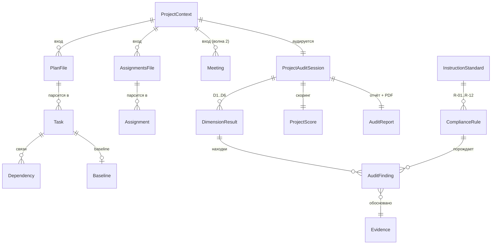

# AI PMO · Сущности demo-версии

**Дата:** 29.07.2026 (актуализация 3 — с учётом Notion-бэклога и репозитория) · **Статус:** черновик к обсуждению
**Скоуп demo:** **одна фича — «Аудит проекта»** (project audit). В бэклоге её нет (проверено); ближайшая существующая — BL-1 «Аудит проектного плана», которая становится одним из измерений аудита проекта.

**Источники:**
- **Notion, [Бэклог AI PMO](https://shadowed-robe-44e.notion.site/32d71c1c84004354ae367b2886ced001?v=9ad42bbec3fe4f43a778b274516f0494)** — 29 фич BL-1…BL-30 (BL-14 отсутствует), поля: Волна, WSJF, AI Agent, Сложность, Ценность. Полная выгрузка — в Приложении А
- **GitHub `Plaxotin/AI-PMO`**: `docs/specs/SPEC-PLAN-AUDIT.md` (BL-1, v1.3), `SPEC-BL-6-assignments-admin-v2.2.md`, `SPEC-BL-18-official-letter-generator.md`, ADR-BL-18-01/02, `supabase/migrations/*` — фактическая схема БД
- `spec_v01_extracted.txt`, `spec_v02_plan_audit.md`, `plan_realizacii_BL1.md` — спецификации BL-1 (десктоп, v0.2.2 — самая свежая)
- `черновики PMO toolbox/`, `доки из практики PMO/` — протоколы, PMI-трекер поручений, Инструкция_Project_Plan.docx, пример статус-отчёта
- Референсы: [Cherry Hill Advisory](https://www.cherryhilladvisory.com/ai-enabled-internal-audit-services), [PMI Infinity](https://www.pmi.org/infinity)

---

## 1. Что уже существует (ground truth)

### 1.1 Бэклог (Notion)

Видение продукта (из карточки проекта): «облачный AI-сервис для управления проектами. Автоматический анализ планов, выявление рисков, мониторинг сроков и уведомления команды».

- **Три роли AI-агентов** (поле «AI Agent»): **Аналитик**, **Администратор проекта**, **Менеджер** — аналог «AI-команды» Cherry Hill в миниатюре.
- **Волна 1** (текущая): BL-1 аудит плана, BL-6 поручения, BL-15 протоколы встреч, BL-2 ИСР, BL-23 устав, BL-24 RACI, BL-25 план рисков, BL-26 план стейкхолдеров, BL-27 промпты, BL-18 письма, BL-20 «Мои результаты».
- **Фичи «Аудит проекта» в бэклоге нет.** Ближайшие по смыслу: BL-1 «Аудит проектного плана» (Критическая) и BL-13 «Project Graph — единая карта проекта» (Критическая, волна 2) — долгосрочный агрегатор всех данных проекта.

### 1.2 Репозиторий (реализовано)

| Сущность | Где | Ключевые поля / enum | Статус |
|---|---|---|---|
| **Tenant** | миграция `bl18_tenants` | id, name, storage_quota_bytes (1 ГБ), storage_used_bytes | ✅ в БД |
| **TenantMember / User** | миграция `bl18_tenants` | tenant_id, user_id, role: `tenant_admin` / `tenant_member` | ✅ в БД |
| **Project** | миграция `bl1_v1` | id, name; `projects.tenant_id` запланирован в BL1-1 | ✅ в БД (без tenant_id) |
| **Assignment** | BL-6 v2.2 — **Google Sheets** (шаблон PMI, колонки A–K) | ID, Brief Name, Description, Source, Owner, Priority `1/2/3`, Date Added, Target Date, Status `1/2/3`, Comments, Completion Date | ✅ в Sheets |
| **Assignment (legacy БД)** | миграция `bl1_v1` (модель отменена, код сохранён) | status `draft/open/done/cancelled`, source `manual/import/webhook/web_upload`, assignee_label | ⚠️ legacy |
| **AssignmentStatusEvent** | `bl1_v1` + BL6_PRODUCT_DECISIONS §1 | event_type `status_change/field_change/created/cancelled`, old/new_value | ⚠️ legacy |
| **IngestJob / Draft** | BL-6 §8 | status `pending/processing/done/failed`, drafts[] из протоколов/аудио (STT SaluteSpeech + Kimi) | ✅ |
| **LetterTemplate + Version** | миграция `bl18_letters` | name, organization, style_passport, версии | ✅ в БД |
| **LetterAuditEvent** | миграция `bl18_letters` | журнал действий, ретенция 13 мес | ✅ в БД |
| **PlanAnalysis (BL-1)** | SPEC-PLAN-AUDIT, `lib/types.ts` | **stateless**: tasks[], cpm_result, task_metrics, plan_score, errors[], risks[], recommendations[] | ✅ спека |

**Архитектурные факты:** две парадигмы хранения (Google Sheets для поручений, Postgres для писем/тенантов, stateless для аудита плана); спека BL-1 в репо (v1.3) старше десктопной v0.2.2 (нет движка Инструкции R-01…R-12 и диаграмм D-01…D-04 — для demo ориентируемся на v0.2.2).

---

## 2. Фича demo — «Аудит проекта»: рамка

**Определение:** пользователь загружает артефакты проекта (план, реестр поручений, протоколы) и получает **целостную оценку здоровья проекта**: качество плана, дисциплину исполнения поручений, покрытие команды и стейкхолдеров, риски, соответствие стандартам. Аналогия — Audit Pulse Snapshot у Cherry Hill (скоринг по доменам + приоритеты + board-ready отчёт), но предмет — проект.

**Измерения аудита, привязанные к бэклогу:**

| # | Измерение | Источник | Что даёт бэклог |
|---|---|---|---|
| D1 | **План и сроки** | Файл плана (xlsx/csv/xml/mpp) | **BL-1** целиком: CPM, R-01…R-12, plan_score |
| D2 | **Поручения и дисциплина исполнения** | Реестр поручений (xlsx / Google Sheet) | **BL-6** (модель, интеграция Sheets) + **BL-3** (статусы, волна 3) |
| D3 | **Команда и ресурсы** | План + реестр | **BL-4** (ресурсный план, волна 2) |
| D4 | **Стейкхолдеры и коммуникации** | Протоколы (волна 2 demo) | **BL-5** (карта коммуникаций), **BL-7** (Stakeholder Pulse), **BL-15** (протоколы) |
| D5 | **Риски и решения** | План + протоколы | **BL-11** (AI Risk Digest, волна 2) |
| D6 | **Соответствие стандартам** | План | Движок Инструкции R-01…R-12 (v0.2.2); позже **BL-22** (методбаза РФ: PMBOK, ГОСТ Р 54869/54870/54871) |

**Эволюция после demo:** BL-13 «Project Graph — единая карта проекта» (Критическая, волна 2) — персистентный граф всех сущностей проекта; аудит проекта становится запросом поверх него. Demo-модель спроектирована так, чтобы лечь в этот граф без ломки (§5).

**Границы demo:** минимум — D1 + D2 (+ D6 внутри D1), вход = 2 файла (план + трекер поручений), выход = один скоринговый отчёт. D3–D5 — вторая волна. Stateless, без регистрации — как BL-1.

---

## 3. Сущности demo «Аудит проекта»

### 3.1 Слой входных данных

#### ProjectContext — контекст аудируемого проекта (сессионный)
| Поле | Тип | Комментарий |
|---|---|---|
| name | string | Из файла или ручной ввод |
| report_date | date | Точка отсечения (R-09/R-10, просрочка поручений) |
| instruction_id | ref → InstructionStandard | В demo — встроенная Инструкция_Project_Plan |

В demo stateless: персистентные Project/Tenant **не** создаём; маппинг на схему репо — §5.

#### PlanFile — файл плана
Без изменений от BL-1: format (xlsx/xls/csv/xml/mpp), лимиты, parse_status, column_mapping (эвристика + LLM).

#### AssignmentsFile — файл реестра поручений
| Поле | Тип | Комментарий |
|---|---|---|
| format | enum | xlsx (PMI-трекер) / csv; **Google Sheet URL — вторая волна** (готовый OAuth из BL-6) |
| column_mapping | json | Маппинг на канонический Assignment |

#### Task, Dependency, Baseline, Milestone, Resource, Calendar
Без изменений от v0.2.2 (поля под движок Инструкции: БСЗР/БСВР, deadline, task_mode, key_result, baseline_*). Task — сессионная, не персистируется.

#### Assignment — поручение (каноническая модель)
Выравнивание моделей BL-6 (Sheets) и legacy-БД на один канон:
| Поле | Тип | Откуда |
|---|---|---|
| id | string | PMI ID |
| brief_name / description | string | PMI Brief Name / Description (legacy: title/description) |
| source_label | string | PMI Source |
| owner_label | string | PMI Owner (legacy: assignee_label); **токенизируется** |
| priority | enum high/medium/low | PMI 1/2/3 → канон |
| date_added / target_date / completion_date | date | |
| status | enum not_started/in_progress/complete (+ derived **overdue**) | PMI 1/2/3 + вывод из target_date < report_date |
| status_comments | text | Running Status Comments |

Маппинг legacy-статусов: draft → not_started, open → in_progress, done → complete, cancelled → исключается.

#### Meeting / Transcript (вторая волна)
Протокол (BL-15): participants[], transcript_chunks[] для RAG, качество ASR ≥ 85–90 %. Порождает Assignment/Decision (deep-research-report).

### 3.2 Слой анализа

#### ProjectAuditSession — сеанс аудита
| Поле | Тип | Комментарий |
|---|---|---|
| id | uuid | |
| inputs[] | ref → PlanFile / AssignmentsFile / Meeting | 1..N источников |
| dimensions[] | enum D1–D6 | По загруженным входам |
| language | enum ru/en | |
| llm_provider / llm_model | string | beta: Kimi, модель зафиксирована |
| status / duration_ms | | Прогресс, SLA |

Наследует AnalysisSession BL-1, расширяя с одного файла на набор источников. **BL-1 = частный случай аудита проекта с измерением D1.**

#### DimensionResult — результат по измерению
| Поле | Тип |
|---|---|
| dimension | enum D1–D6 |
| score | number 0–100 |
| metrics | json (детерминированные, не LLM) |
| findings[] | ref → AuditFinding |

Метрики:
- **D1**: plan_score (5 критериев), critical_path_days, task_metrics (overdue_total, no_predecessors, no_owner… — SPEC-PLAN-AUDIT §7), compliance_score
- **D2**: assignments_total, done_pct, overdue_pct, no_owner_pct, no_deadline_pct, avg_age_open — по образцу статус-отчёта («выдано/выполнено/просрочено/на контроле»)
- **D3**: tasks_with_owner_pct, owners_count, max_tasks_per_owner
- **D5**: risks_total, risks_without_mitigation

#### AuditFinding — находка аудита
Унификация Finding (BL-1) и ComplianceViolation (v0.2.2):
| Поле | Тип |
|---|---|
| dimension | enum D1–D6 |
| severity | high / medium / low |
| type | из типизированного словаря (missing_dependency, overdue_assignment, no_owner…) |
| object_ref | ссылка на Task / Assignment / Milestone |
| message / suggestion | string |
| confidence | 0–1 |
| evidence_id | ref → Evidence (**обязательно**) |
| rule_ref / instruction_ref | для находок движка стандартов |

#### Evidence — обоснование
facts[] (конкретные значения полей), source: `algorithm / rule_engine / llm`. Принцип: **AI интерпретирует, алгоритм считает** — LLM получает только факты движков (AC-19 на все измерения). Это же заложено в бэклоге отдельной фичей **BL-12 «Checkpoints — режим прозрачности AI»** — в demo Evidence зашит в ядро.

#### ComplianceRule / InstructionStandard
R-01…R-12 из v0.2.2, детерминированный движок, правила в конфиге. Входит в D1/D6. Перспектива — внешняя методбаза (BL-22: PMBOK RU, ГОСТ Р 54869/54870/54871).

#### ProjectScore — сводная оценка
| Поле | Тип |
|---|---|
| overall | 0–100, взвешенная сумма |
| per_dimension[] | {dimension, score, weight} |
| maturity_label | «требует вмешательства / управляем / зрелый» — readiness-шкала как у Cherry Hill |

#### AuditReport — отчёт
sections[] (скоринг по измерениям, находки с evidence, приоритетные рекомендации, реестр рисков), diagrams[] (D-01…D-04 + radar по измерениям), PDF executive 1 стр. + полная версия, дисклеймер + confidence. Board-ready.

### 3.3 Слой платформы (без изменений)
LLMProvider (Kimi, абстракция `lib/llm.ts`), DeidentificationMap (ФИО → P-### до LLM; owner_label — так же), RateLimit (3/день free), QualityFramework (5 уровней: evidence, фиксация модели, дисклеймер, confidence).

---

## 4. Диаграмма связей (demo)

---

## 5. Маппинг на персистентную модель (после demo → Project Graph)

| Demo-сущность | Цель в репо / бэклоге | Комментарий |
|---|---|---|
| ProjectContext | `projects` (+ `tenant_id` из BL1-1) | |
| Assignment | Google Sheets (BL-6) или legacy `assignments` | Канон §3.1 покрывает обе |
| ProjectAuditSession | новая `audit_sessions` → узел **BL-13 Project Graph** | project_id, inputs jsonb, status |
| DimensionResult / ProjectScore | новая `audit_results` → метрики узлов графа | session_id, dimension, score, metrics jsonb |
| AuditFinding | новая `audit_findings` | evidence jsonb — задел под BL-12 Checkpoints |
| Meeting / Decision | BL-15 (протоколы) | |
| Стейкхолдеры, RACI | BL-26, BL-24 (генераторы) | В demo — не сущности, а будущие источники D4 |
| — | `tenants`, `tenant_members` | С регистрацией (v0.3+), в demo нет |

---

## 6. Приоритизация

**P0 — demo «Аудит проекта» (минимум для показа):**
ProjectContext, PlanFile, AssignmentsFile, Task, Dependency, Baseline, Assignment, ProjectAuditSession, DimensionResult (D1, D2, D6), AuditFinding, Evidence, ComplianceRule, ProjectScore, AuditReport, DeidentificationMap, LLMProvider, RateLimit.
Вход: план + xlsx-трекер поручений. Выход: скоринговый отчёт с radar по измерениям.

**P1 — demo, волна 2:** D3–D5; Meeting/Transcript (BL-15), Decision; подключение Google Sheet вместо xlsx (интеграция BL-6 готова).

**P2 — после demo:** персистентность (audit_sessions → Supabase), User/Tenant, BL-13 Project Graph, генераторы документов волны 1 бэклога (BL-23 устав, BL-24 RACI, BL-25 риски, BL-26 стейкхолдеры) по образцу PMI Infinity, BL-21 PM Knowledge Chat (RAG с цитированием — ядро аналога PMI Infinity).

**Сознательно вне demo:** регистрация, платежи, загрузка своей инструкции, master-проекты, BL-9 no-code конструктор агентов, BL-10 multiplayer.

---

## 7. Решения и открытые вопросы

**Решено (29.07.2026):**
1. ✅ Рамка «Аудита проекта» (D1–D6, минимум demo = план + поручения) подтверждена. После demo фичу завести в бэклог под свободным кодом **BL-14**.
2. ✅ Вход поручений в demo — **только xlsx-трекер** (PMI Action Item Tracker). Google Sheet — вторая волна (OAuth из BL-6 уже написан).
3. ✅ ProjectScore: **калибровка на тестовом корпусе** (План_график_АСУП + трекер поручений), затем экспертная переоценка весов и шкалы зрелости.
4. ✅ Актуальная спека BL-1 для demo — **v0.2.2** (десктопная, с движком Инструкции R-01…R-12 и диаграммами D-01…D-04). Версии v0.1 и репо v1.3 устарели; из v1.3 при синхронизации с репо стоит перенести детерминированные `task_metrics` и Zod-контракты.

---

## Приложение А. Выгрузка бэклога (Notion, 29.07.2026)

| Код | Волна | WSJF | AI Agent | Сложн. | Ценность | Задача |
|---|---|---|---|---|---|---|
| BL-1 | 1 | 0.09 | Аналитик | XL | Критическая | Аудит проектного плана |
| BL-2 | 1 | 7 | Аналитик | M | Высокая | Создание ИСР |
| BL-3 | 3 | 0.17 | Администратор проекта | L | Высокая | Отслеживание хода исполнения и актуализация статусов |
| BL-4 | 2 | 0.38 | Администратор проекта | M | Высокая | Администратор ресурсного плана |
| BL-5 | 2 | 1.33 | Администратор проекта | S | Средняя | Администратор карты коммуникаций |
| BL-6 | 1 | 2 | Администратор проекта | S | Высокая | Администратор поручений |
| BL-7 | 3 | 2.5 | Аналитик | M | Средняя | Stakeholder Pulse (NLP тональности) |
| BL-8 | 3 | 3 | Аналитик | L | Высокая | Knowledge Engine (обучение на проектах) |
| BL-9 | 3 | 3 | Администратор проекта | L | Средняя | No-code конструктор PMO-агентов |
| BL-10 | 2 | 4 | Менеджер | M | Средняя | Multiplayer-first — командный режим |
| BL-11 | 2 | 6 | Аналитик | M | Высокая | AI Risk Digest — дайджест рисков |
| BL-12 | 3 | 7 | Менеджер | M | Высокая | Checkpoints — прозрачность AI |
| BL-13 | 2 | 8 | Аналитик | XL | Критическая | Project Graph — единая карта проекта |
| BL-15 | 1 | 8 | Администратор проекта | L | Высокая | Meeting notes — протоколы встреч |
| BL-16 | 3 | 0.17 | Администратор проекта | L | Высокая | Администратор финмодели проекта |
| BL-17 | 2 | 7 | Аналитик | L | Высокая | Анализ контрактов |
| BL-18 | 1 | 9 | Менеджер | S | Высокая | Генератор официальных писем |
| BL-19 | 2 | 3 | Менеджер | M | Средняя | Data Flow UX — связи между инструментами |
| BL-20 | 1 | 5 | Администратор проекта | M | Высокая | Мои результаты — артефакты и отчёты |
| BL-21 | 2 | 8 | Менеджер | L | Критическая | PM Knowledge Chat (ядро аналога PMI Infinity) |
| BL-22 | 2 | 7.5 | Аналитик | M | Критическая | Методбаза РФ (PMBOK, ГОСТ Р 54869/54870/54871) |
| BL-23 | 1 | 9 | Менеджер | S | Высокая | Генератор устава проекта |
| BL-24 | 1 | 8 | Администратор проекта | S | Высокая | Генератор RACI-матрицы |
| BL-25 | 1 | 7 | Аналитик | M | Высокая | Генератор плана управления рисками |
| BL-26 | 1 | 6 | Менеджер | M | Средняя | Генератор плана управления стейкхолдерами |
| BL-27 | 1 | 5 | Менеджер | S | Средняя | Библиотека промптов |
| BL-28 | 2 | 7 | Аналитик | S | Высокая | Генератор NFR |
| BL-29 | 3 | 3 | Аналитик | M | Низкая | Симулятор экзамена (PMBOK/ГОСТ) |
| BL-30 | 3 | 2 | Аналитик | M | Низкая | Curriculum Support |

BL-14 отсутствует в базе (код свободен). ТЗ есть только у BL-1, BL-6, BL-18 (GitHub) и BL-15 (Notion).
